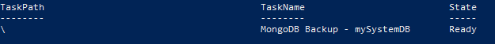
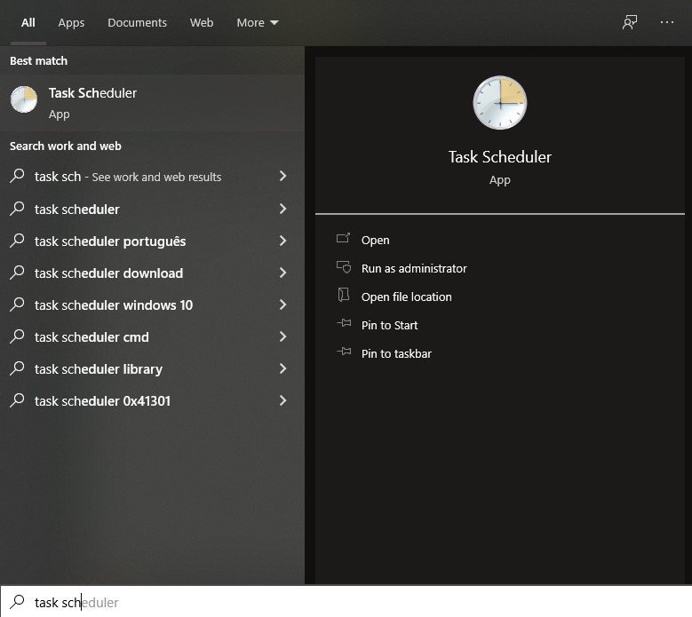
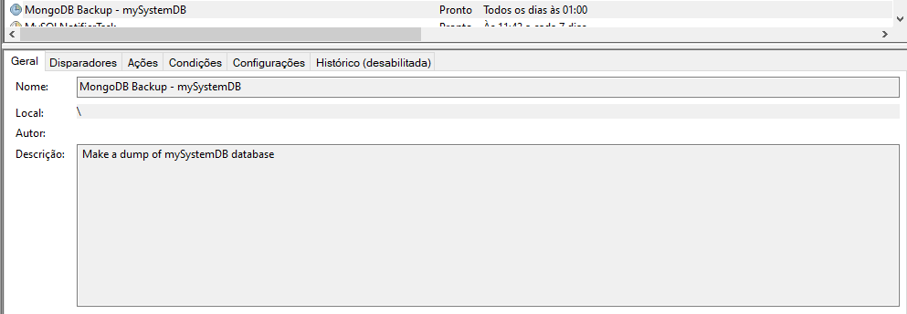

# :ballot_box: Dump MongoDB Database

It's a simple script made with PowerShell to create a backup of a MongoDB database and save all collections in a _.zip_ folder.

## :arrows_clockwise: Creating a simple backup flow

__1.__ Verify the version of MongoDB, running:
```powershell
mongod --version
```

__2.__ If the version of your MongoDB is 4.4 or above, you will need install de _mongodump, mongorestore_ and other tools separately. For this, follow this guide: [Installing the Database Tools on Windows](https://docs.mongodb.com/database-tools/installation/installation-windows/)
> "Starting with MongoDB 4.4, the MongoDB Database Tools are now released separately from the MongoDB Server..."

__3.__ After the installation or if your version already has the database tools (like in the version 4.2), run the following commands to guarantee that the tools are accessable by the command line:
```powershell
mongodump --help
```
```powershell
mongorestore --help
```
> If they are not accessable, follow this guide: [Make the DB Tools available in your PATH](https://docs.mongodb.com/database-tools/installation/installation-windows/#make-the-db-tools-available-in-your-path)

__4.__ After all the process of installation/verification we will create the flow properly

  __4.1__ Edit the [backupMongoDatabase.ps1](https://github.com/pferreirafabricio/powerShell-dumpMongoDB/blob/main/backupMongoDatabase.ps1) script, modifing the variables:
  ```powershell
  $databaseName = "databaseName"
  $mongoDbHost = "localhost:27017"
  $backupPath = "C:\Path\To\Back\Folder"
  ```
  > __OBS:__ If the database requires authorization remember to use the command with __-u__ and __-p__ flags
  
  __4.2.__ Edit the [createSystemScheduledTask.ps1](https://github.com/pferreirafabricio/powerShell-dumpMongoDB/blob/main/createSystemScheduledTask.ps1) script, modifing the  variable with the path of the ___dumpMongoDatabase.ps1___ script and the time that the task will run
   ```powershell
  $scriptToExecutePath = "C:\Path\To\dumpMongoDatabase.ps1"
  $trigger = New-ScheduledTaskTrigger -Daily -At 1am
  ```
  > __OBS:__ Change the 'databaseName' in the name and description too, for more control of wich database that task will backup
  
  __4.3.__ Finally, open the PowerShell as admin (for precaution) and enter in the folder that the ___createSystemScheduledTask.ps1___ is
  ```powershell
  cd "C:\Path\To\createSystemScheduledTask.ps1"
  ```
  
  __4.4.__ And execute it
  ```powershell
  ./createSystemScheduledTask.ps1
  ```
  
  __4.5.__ The following output will be showed
  <br/>
  
  
__5.__ :white_check_mark: Success! We created a basic backup task. You can check the task in _Task Scheduler_ too:

<br/><br/>
The task:


__6.__ Test if the task is running correctly executing it manually:
```powershell
Start-ScheduledTask -TaskName 'MongoDB Backup - <databaseName>'
```

### :recycle: Need restore a database using the backup?

Take a look at this discussion at _DBA Stack Exchange_: [How restore a specific database from backup using mongorestore command
](https://dba.stackexchange.com/questions/113017/how-restore-a-specific-database-from-backup-using-mongorestore-command)
  
## :page_with_curl: References

- [New-ScheduledTaskTrigger](https://docs.microsoft.com/en-us/powershell/module/scheduledtasks/new-scheduledtasktrigger?view=win10-ps)
- [Powershell scripts for MSSQL or MongoDB backup to Azure & AWS](https://piotrgankiewicz.com/2016/05/03/powershell-scripts-for-mssql-or-mongodb-backup-to-azure-aws/)
- [Installing the Database Tools](https://docs.mongodb.com/database-tools/installation/installation/)
- [How to find the exact version of installed MongoDB](https://stackoverflow.com/questions/38160412/how-to-find-the-exact-version-of-installed-mongodb#:~:text=To%20check%20mongodb%20version%20use%20the%20mongod%20command%20with%20%2D%2Dversion%20option.)
- [Add 'powershell' code fences where appropriate](https://github.com/MicrosoftDocs/PowerShell-Docs/issues/1511)
- [How restore a specific database from backup using mongorestore command](https://dba.stackexchange.com/questions/113017/how-restore-a-specific-database-from-backup-using-mongorestore-command)
